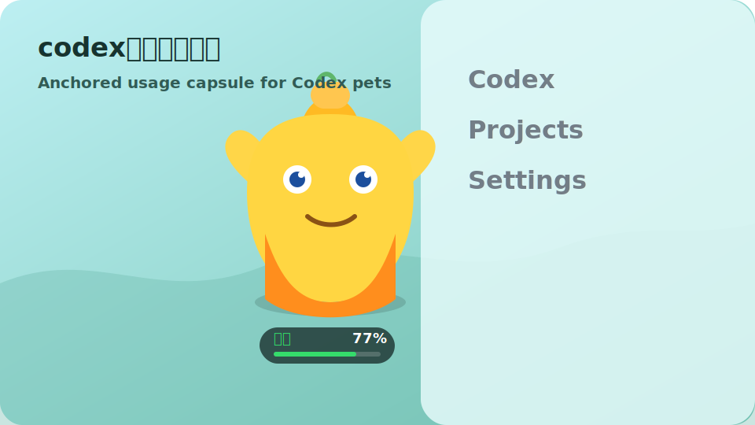
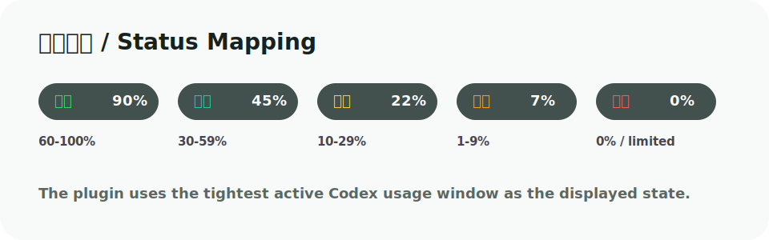
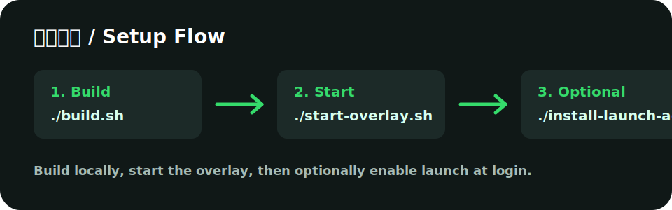

# codex桌宠用量插件

一个 macOS 本地小插件，用来给 Codex 桌宠增加“剩余用量状态胶囊”。

它会锚定并跟随 Codex 桌宠移动，读取 Codex 当前用量限制，然后用一个小胶囊显示状态和剩余百分比。插件不修改 Codex.app，也不上传任何数据。



## 功能

- 跟随 Codex 桌宠移动
- 跟随 Codex 桌宠显示和隐藏
- 从 Codex 宠物 `spritesheet.webp` 裁切不同情绪动作
- 显示 Codex 当前剩余用量百分比
- 根据剩余用量切换状态文案
- 胶囊尺寸小，不遮挡对话列表
- 低频读取用量，避免频繁刷写 Codex 本地日志
- 支持手动启动、停止
- 支持登录 macOS 后自动启动

## 状态说明

插件只读取 Codex 的 5 小时用量窗口，并以 5 小时剩余量作为总状态。

| 剩余用量 | 显示状态 |
| --- | --- |
| 60-100% | 满电 |
| 30-59% | 稳定 |
| 10-29% | 省用 |
| 1-9% | 低电 |
| 0% 或达到限制 | 重置倒计时 |



## 情绪动作

插件会从本机宠物图集读取不同动作帧：

```text
~/.codex/pets/sproutpal/spritesheet.webp
```

| 用量状态 | 小噜噜动作 |
| --- | --- |
| 满电 | 开心跳跃 |
| 稳定 | 抱手待机 |
| 省用 | 思考 |
| 低电 | 难过 |
| 0% / 限制 | 重置倒计时 + 难过休息 |

## 安装要求

- macOS
- 已安装 Codex 桌面版
- 系统有 Swift 编译工具，通常安装 Xcode Command Line Tools 后即可

检查 Swift：

```sh
which swiftc
```

## 构建

进入项目目录：

```sh
cd codex-pet-limits
./build.sh
```

构建脚本会：

- 使用 `swiftc` 编译 `CodexPetLimitOverlay.swift`
- 对生成的本地程序做 ad-hoc 签名，避免 macOS 启动时拦截

## 启动

```sh
./start-overlay.sh
```

启动后，Codex 桌宠附近会出现一个小胶囊，例如：

```text
满电 77%
```

胶囊会跟随桌宠移动。

## 停止

```sh
./stop-overlay.sh
```

## 开机自启

```sh
./install-launch-agent.sh
```

这会创建并加载：

```text
~/Library/LaunchAgents/com.yy.codex-pet-limits.plist
```

如果你只想手动启动胶囊，不需要运行这个命令。



## 读取的数据

插件只读取本机数据：

- `~/.codex/.codex-global-state.json`

用于获取 Codex 桌宠当前位置。

- `codex app-server --stdio`
- `account/rateLimits/read`

用于读取 Codex 当前 rate limits。插件只在桌宠可见时保持一个本地连接，并且最多每 5 分钟刷新一次用量，避免反复启动 `app-server` 导致 Codex 本地日志膨胀。

## 自动清理日志

旧版本如果高频读取过用量，可能让 `~/.codex/logs_2.sqlite` 变得很大。可以安装安全清理器：

```sh
./install-cleanup-agent.sh
```

清理器会在登录后、每小时、每天 04:20 运行一次。它只在日志库超过 200MB 时处理，并且如果 Codex 正在运行会自动跳过，避免移动正在写入的 SQLite 文件。

默认会删除旧的 Codex 日志缓存，避免换个目录继续占空间。它不会删除会话、配置、宠物资源或认证文件。需要保留日志备份时，可以运行前设置 `KEEP_ARCHIVES=1`。

## 常见问题

### 没显示胶囊

先确认程序是否正在运行：

```sh
ps aux | grep CodexPetLimitOverlay
```

如果没运行，重新启动：

```sh
./start-overlay.sh
```

### 更新后打不开

重新构建并签名：

```sh
./build.sh
./start-overlay.sh
```

### 胶囊位置不合适

当前胶囊锚定在桌宠脚边，位置刷新间隔是 `0.5` 秒。桌宠隐藏时胶囊也会隐藏。可以在 `CodexPetLimitOverlay.swift` 里调整 `movePanel(to:)` 的偏移量。

### 卸载

停止插件：

```sh
./stop-overlay.sh
```

删除开机自启和清理器：

```sh
./uninstall-agents.sh
```

然后删除项目目录即可。

## 说明

这个插件是一个轻量的本地辅助工具。它不会修改 Codex 的桌宠资源，也不会控制桌宠本体动画；它通过一个独立透明窗口显示用量状态。

---

# English Guide

This is a tiny macOS overlay plugin for the Codex desktop pet. It follows the pet, reads local Codex rate limits, and displays a compact usage capsule.

## Quick Start

```sh
cd codex-pet-limits
./build.sh
./start-overlay.sh
```

Stop:

```sh
./stop-overlay.sh
```

Enable launch at login:

```sh
./install-launch-agent.sh
```

Install the safe log cleanup agent:

```sh
./install-cleanup-agent.sh
```

The cleanup agent runs at login, hourly, and every day at 04:20. It only cleans `~/.codex/logs_2.sqlite` when it is larger than 200MB and Codex is not running.

By default it removes old Codex log cache files instead of keeping large archives around. Set `KEEP_ARCHIVES=1` before running it if you want to keep one backup.

Disable both agents:

```sh
./uninstall-agents.sh
```

The plugin only reads local Codex state and rate-limit data. It does not modify Codex.app and does not upload data.
